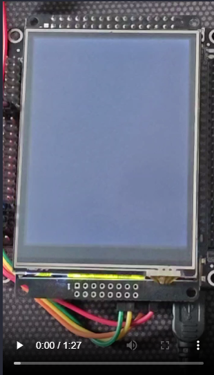

# Embedded Weather Display System (STM32 + ESP8266)

A real-time embedded weather dashboard that combines WiFi API data with local sensor readings and presents it on a touchscreen LCD. Designed as a complete embedded system demo for UI, connectivity, and sensor integration.

## Demo Video

Click the image to open the demo video on Google Drive.

## Highlights (Recruiter-Friendly)

- Real-time weather data from Open-Meteo API via ESP8266 (UART + AT commands)
- Touchscreen UI with 3 screens: current weather, 6-day forecast, and location selection
- Automatic refresh every 5 minutes using timer-based scheduling
- Local DHT sensor integration for temperature and humidity
- JSON parsing with cJSON for reliable data extraction

## Platform and Tech

- MCU: STM32 (STM32F4 series)
- WiFi module: ESP8266
- Display: ILI9341-based TFT LCD (FSMC/SPI)
- Sensors: DHT temperature/humidity
- Interfaces: UART, SPI, FSMC, GPIO
- Language: C (STM32 HAL)

## UI Screens

1. Current Weather
   - Temperature, humidity, weather code, cloud cover, date/time
2. 6-Day Forecast
   - Daily max/min temperature, wind speed, weather code
3. Location Selection
   - 5 cities: Ho Chi Minh, Ha Noi, Hai Phong, Can Tho, Da Nang

## How It Works (System Flow)

- ESP8266 connects to WiFi and calls Open-Meteo API via HTTP GET.
- The STM32 receives the response through UART and parses JSON payloads.
- Parsed values are stored in global variables and the UI is redrawn when new data arrives.
- Touch input updates the current screen and selected city, triggering a new API request.

## Architecture (At a Glance)

- ESP8266 handles WiFi + HTTP, sends JSON to STM32 via UART
- STM32 parses JSON, updates UI, and reads local DHT sensor
- LCD is driven by FSMC/SPI; touch input controls screen navigation
- Timer triggers periodic API refresh (default: 5 minutes)

## Project Structure

- Core/Inc, Core/Src: main application, UI, sensors, drivers
- Drivers: STM32 HAL and CMSIS
- Startup: linker/startup scripts
- Debug: build outputs

## Testing Summary

- WiFi connection and API requests: Pass
- Weather data reception via UART: Pass
- UI rendering and screen transitions: Pass
- DHT sensor readings: Pass
- City selection and data refresh: Pass

## Limitations

- No robust recovery if ESP8266 disconnects during runtime
- Some UI redraws can be affected by delays in blocking calls

## Possible Improvements

- Add reconnection and retry logic for WiFi/API failures
- Replace blocking delays with a non-blocking scheduler
- Add caching to avoid redundant redraws

## Reference Links

- Open-Meteo API: https://open-meteo.com/
- DHT HAL driver: https://github.com/quen0n/DHT11-DHT22-STM32-HAL
- cJSON: https://github.com/DaveGamble/cJSON
- ILI9341 FSMC reference: https://github.com/taburyak/STM32-ILI9341-320x240-FSMC-Library/blob/master/README.md

## Repository

https://github.com/buithan04-uit/DoAnHeThongNhung
